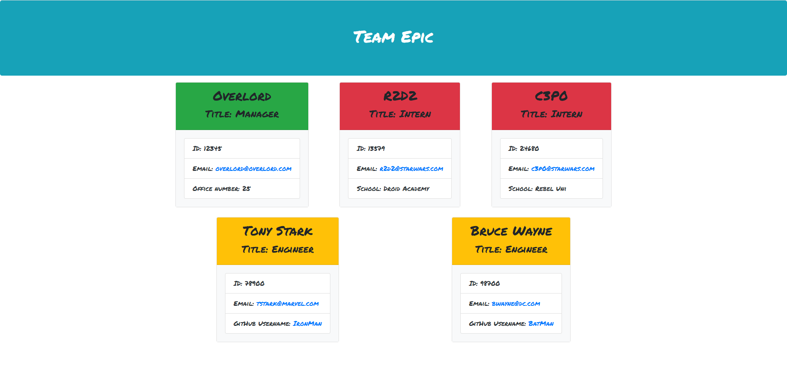

# 10-Team-Profile-Generator


## Challenge User Story

```md
AS A manager
I WANT to generate a webpage that displays my team's basic info
SO THAT I have quick access to their emails and GitHub profiles
```


## Challenge Acceptance Criteria

```md
GIVEN a command-line application that accepts user input
WHEN I am prompted for my team members and their information
THEN an HTML file is generated that displays a nicely formatted team roster based on user input
WHEN I click on an email address in the HTML
THEN my default email program opens and populates the TO field of the email with the address
WHEN I click on the GitHub username
THEN that GitHub profile opens in a new tab
WHEN I start the application
THEN I am prompted to enter the team manager’s name, employee ID, email address, and office number
WHEN I enter the team manager’s name, employee ID, email address, and office number
THEN I am presented with a menu with the option to add an engineer or an intern or to finish building my team
WHEN I select the engineer option
THEN I am prompted to enter the engineer’s name, ID, email, and GitHub username, and I am taken back to the menu
WHEN I select the intern option
THEN I am prompted to enter the intern’s name, ID, email, and school, and I am taken back to the menu
WHEN I decide to finish building my team
THEN I exit the application, and the HTML is generated
```


## General info

This is a command-line application that dynamically generates an html page about a software engineering team based on user provided information. First the user must use the following command to install dependencies required:
```sh
npm i
```
The application is then invoked with the following commands:
```sh
node index.js
```
The application will then prompt the user to provide information about the manager and any number of additional team members which can be selected to be either engineers or interns. 
There are also unit tests included to test that the sub-classes (managers, engineers, interns) inherit properties from the super class of employee and that the constructor arguments return the passed values:
```sh
npm run test
```


## Applied Technologies

* [Node.js](https://nodejs.org/en/docs/) 
* [NPM](https://www.npmjs.com/) 
* [Inquirer package](https://www.npmjs.com/package/inquirer/v/8.2.4)
* [Jest package](https://www.npmjs.com/package/jest)
* [Bootstrap](https://getbootstrap.com/)


## Application Functionality

The following image shows html output generated by the application:



The following video demonstrates the application's functionality:


The following is a link to the generated sample README:

